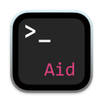

<div align="center">



# AidTerm

**A modern, cross-platform terminal emulator**

[](https://github.com/JerryJian/AidTerm/releases)
[](LICENSE)
[](#download)
[](.github/workflows/release.yml)

</div>

---

AidTerm is a cross-platform terminal emulator built with **Tauri 2 + Vue 3 + Rust**, with an optional **Electron backend** for compatibility with older Linux distributions. It packs SSH/Telnet/Serial sessions, SFTP, port forwarding, an AI assistant and more into a polished, tabbed interface.

> **Recommended: Tauri build.** The Electron build is provided as an alternative for environments where the Tauri WebView runtime is unavailable or outdated.

## Features

### Connectivity
- SSH2 with password & key authentication, and port forwarding
- Telnet
- Serial (baud rate, data bits, stop bits, parity)
- Local shell (cmd, PowerShell, bash, zsh — auto-detected)
- SFTP file browser: upload, download, delete, rename
- Remote file editing with a built-in editor

### Terminal
- Full-featured [xterm.js](https://xtermjs.org/) terminal emulation
- Multi-tab sessions with rename & context menu
- Split panes (horizontal / vertical)
- Search (forward / backward)
- Copy-on-select, paste, unlimited scrollback (configurable up to 1,000,000 lines)
- Dark / light themes, window transparency, background images

### Session & Productivity
- Session store with groups & recently used
- Quick connect bar (`ssh user@host`)
- Snippets with `{{var}}` variables
- Triggers — auto-respond to terminal output
- Broadcast input to multiple tabs at once

### Security & Tunneling
- SSH key management (RSA / ED25519 generate, import, delete)
- known_hosts management
- Port forwarding (Local / Remote / Dynamic)
- Proxy support (HTTP / SOCKS5 / Jump Host)

### AI Assistant
- OpenAI-compatible providers: DeepSeek, DashScope, Ollama, OpenAI
- Natural language → command suggestion with in-terminal confirmation
- Shell script generation
- Explain selected terminal output

### App
- Check for updates — download & install straight from GitHub Releases (MSI/EXE detection on Windows)
- i18n (Chinese / English)
- Lock screen, fullscreen (F11)
- `ssh://` deep link

## Screenshots

_Coming soon — please add screenshots of the main window, sessions, SFTP and the AI panel._

## Download

Download the latest installer for your platform from the [Releases](https://github.com/JerryJian/AidTerm/releases) page.

| Platform | Tauri (recommended) | Electron |
|----------|---------------------|----------|
| Windows (x64) | `AidTerm_*_x64_setup.exe` / `AidTerm_*_x64_en-US.msi` | `AidTerm_electron_*_x64_setup.exe` |
| Linux (x64 / ARM64) | `AidTerm_*_x64.deb` + `.AppImage` | `AidTerm_electron_*_x64.deb` + `.AppImage` |
| macOS (Apple Silicon) | `AidTerm_*_arm64.dmg` | `AidTerm_electron_*_arm64.dmg` |

## Tech Stack

| Layer | Technology |
|-------|-----------|
| Desktop Framework | Tauri 2.x (Rust) + Electron (dual backend) |
| Frontend | Vue 3 + TypeScript + Vite |
| State Management | Pinia |
| Routing | Vue Router |
| Terminal Rendering | xterm.js + addons (fit, search, web-links) |
| SSH | russh (Rust) / ssh2 (Electron) |
| SFTP | russh-sftp / ssh2-sftp-client |
| Serial | tokio-serial / serialport |
| PTY | portable-pty / node-pty |
| Proxy | tokio-socks |
| AI | reqwest + async-openai + ollama-rs (OpenAI-compatible) |
| Keys | russh::keys |

## Getting Started

### Prerequisites

- [Node.js](https://nodejs.org/) >= 18
- [Rust](https://rustup.rs/) — required for the Tauri backend
- Platform system dependencies — see the [Tauri prerequisites](https://v2.tauri.app/start/prerequisites/)

### Tauri (recommended)

```bash
npm install
npm run tauri dev          # run in development mode
npm run tauri build        # build the production bundle
```

### Electron

```bash
cd src-electron
npm install
npm run dev                # run in development mode
npm run dist               # package with electron-builder
```

## Project Structure

```
src/                    # Vue frontend (shared by Tauri & Electron)
├── api/                # unified IPC adapter (auto-detects the backend)
├── components/         # terminal, session, sftp, tunnel, ai, settings, ...
├── stores/             # Pinia stores
├── hooks/              # composables
├── i18n/               # Chinese / English translations
├── router/             # Vue Router
└── types/              # TypeScript types

src-electron/           # Electron backend (node-pty / ssh2 / serialport)
src-tauri/              # Tauri Rust backend
├── src/
│   ├── commands/       # Tauri IPC commands
│   ├── session/        # local, ssh, telnet
│   ├── serial/  sftp/  tunnel/  proxy/  keychain/  ai/  crypto/
│   └── zmodem.rs  session_store.rs
└── Cargo.toml
```

## Roadmap

- [ ] SCP / Zmodem / Trzsz file transfer
- [ ] Session import/export & connection sharing
- [ ] System tray, Guake mode, customizable shortcuts
- [ ] Session recording & playback
- [ ] AI bookmarks, MCP protocol
- [ ] Cloud sync (GitHub Gist / WebDAV)
- [ ] ssh-agent / X11 forwarding

## Contributing

Contributions of all kinds are welcome — report a bug, request a feature, or submit a pull request.

1. Fork the repository
2. Create your feature branch (`git checkout -b feat/your-feature`)
3. Commit your changes (`git commit -m 'feat: add something'`)
4. Push to the branch (`git push origin feat/your-feature`)
5. Open a pull request

## License

[MIT](LICENSE)
